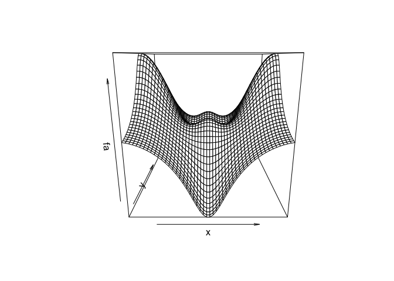

Ch2-statlearn-lab
================

# Note: added a few comments while following through the lab

  - Set root directory for knitr
  - Still confused about the interactive plot method identify()

# Lab: Introduction to R

In this lab, we will introduce some simple `R` commands. The best way to
learn a new language is to try out the commands. `R` can be downloaded
from

`http://cran.r-project.org/`

We recommend that you run `R` within an integrated development
environment (IDE) such as `RStudio`, which can be freely downloaded from

`http://rstudio.com`

The `RStudio` website also provides a cloud-based version of `R`, which
does not require installing any software.

## Basic Commands

`R` uses *functions* to perform operations. To run a function called
`funcname`, we type `funcname(input1, input2)`, where the inputs (or
*arguments*) `input1` and `input2` tell `R` how to run the function. A
function can have any number of inputs. For example, to create a vector
of numbers, we use the function `c()` (for *concatenate*). Any numbers
inside the parentheses are joined together. The following command
instructs `R` to join together the numbers 1, 3, 2, and 5, and to save
them as a vector named `x`. When we type `x`, it gives us back the
vector.

``` r
x <- c(1, 3, 2, 5)
x
```

    ## [1] 1 3 2 5

Note that the `>` is not part of the command; rather, it is printed by
`R` to indicate that it is ready for another command to be entered. We
can also save things using `=` rather than `<-`:

``` r
x = c(1, 6, 2)
x
```

    ## [1] 1 6 2

``` r
y = c(1, 4, 3)
```

Hitting the *up* arrow multiple times will display the previous
commands, which can then be edited. This is useful since one often
wishes to repeat a similar command. In addition, typing `?funcname` will
always cause `R` to open a new help file window with additional
information about the function `funcname()`.

We can tell `R` to add two sets of numbers together. It will then add
the first number from `x` to the first number from `y`, and so on.
However, `x` and `y` should be the same length. We can check their
length using the `length()` function.

``` r
length(x)
```

    ## [1] 3

``` r
length(y)
```

    ## [1] 3

``` r
x + y
```

    ## [1]  2 10  5

The `ls()` function allows us to look at a list of all of the objects,
such as data and functions, that we have saved so far. The `rm()`
function can be used to delete any that we don’t want.

``` r
ls()
```

    ## [1] "x" "y"

``` r
rm(x, y)
ls()
```

    ## character(0)

It’s also possible to remove all objects at once:

``` r
rm(list = ls())
```

The `matrix()` function can be used to create a matrix of numbers.
Before we use the `matrix()` function, we can learn more about it:

``` r
?matrix
```

The help file reveals that the `matrix()` function takes a number of
inputs, but for now we focus on the first three: the data (the entries
in the matrix), the number of rows, and the number of columns. First, we
create a simple matrix.

``` r
x <- matrix(data = c(1, 2, 3, 4), nrow = 2, ncol = 2)
x
```

    ##      [,1] [,2]
    ## [1,]    1    3
    ## [2,]    2    4

Note that we could just as well omit typing `data=`, `nrow=`, and
`ncol=` in the `matrix()` command above: that is, we could just type

``` r
x <- matrix(c(1, 2, 3, 4), 2, 2)
x
```

    ##      [,1] [,2]
    ## [1,]    1    3
    ## [2,]    2    4

and this would have the same effect. However, it can sometimes be useful
to specify the names of the arguments passed in, since otherwise `R`
will assume that the function arguments are passed into the function in
the same order that is given in the function’s help file. As this
example illustrates, by default `R` creates matrices by successively
filling in columns. Alternatively, the `byrow = TRUE` option can be used
to populate the matrix in order of the rows.

``` r
matrix(c(1, 2, 3, 4), 2, 2, byrow = TRUE)
```

    ##      [,1] [,2]
    ## [1,]    1    2
    ## [2,]    3    4

Notice that in the above command we did not assign the matrix to a value
such as `x`. In this case the matrix is printed to the screen but is not
saved for future calculations. The `sqrt()` function returns the square
root of each element of a vector or matrix. The command `x^2` raises
each element of `x` to the power `2`; any powers are possible, including
fractional or negative powers.

``` r
sqrt(x)
```

    ##          [,1]     [,2]
    ## [1,] 1.000000 1.732051
    ## [2,] 1.414214 2.000000

``` r
x^2
```

    ##      [,1] [,2]
    ## [1,]    1    9
    ## [2,]    4   16

The `rnorm()` function generates a vector of random normal variables,
with first argument `n` the sample size. Each time we call this
function, we will get a different answer. Here we create two correlated
sets of numbers, `x` and `y`, and use the `cor()` function to compute
the correlation between them.

``` r
x <- rnorm(50)
y <- x + rnorm(50, mean = 50, sd = .1)
cor(x, y)
```

    ## [1] 0.9968279

By default, `rnorm()` creates standard normal random variables with a
mean of
 and a standard deviation of
. However, the mean and standard deviation can be altered using the
`mean` and `sd` arguments, as illustrated above. Sometimes we want our
code to reproduce the exact same set of random numbers; we can use the
`set.seed()` function to do this. The `set.seed()` function takes an
(arbitrary) integer argument.

``` r
set.seed(1303)
rnorm(50)
```

    ##  [1] -1.1439763145  1.3421293656  2.1853904757  0.5363925179  0.0631929665
    ##  [6]  0.5022344825 -0.0004167247  0.5658198405 -0.5725226890 -1.1102250073
    ## [11] -0.0486871234 -0.6956562176  0.8289174803  0.2066528551 -0.2356745091
    ## [16] -0.5563104914 -0.3647543571  0.8623550343 -0.6307715354  0.3136021252
    ## [21] -0.9314953177  0.8238676185  0.5233707021  0.7069214120  0.4202043256
    ## [26] -0.2690521547 -1.5103172999 -0.6902124766 -0.1434719524 -1.0135274099
    ## [31]  1.5732737361  0.0127465055  0.8726470499  0.4220661905 -0.0188157917
    ## [36]  2.6157489689 -0.6931401748 -0.2663217810 -0.7206364412  1.3677342065
    ## [41]  0.2640073322  0.6321868074 -1.3306509858  0.0268888182  1.0406363208
    ## [46]  1.3120237985 -0.0300020767 -0.2500257125  0.0234144857  1.6598706557

We use `set.seed()` throughout the labs whenever we perform calculations
involving random quantities. In general this should allow the user to
reproduce our results. However, as new versions of `R` become available,
small discrepancies may arise between this book and the output from `R`.

The `mean()` and `var()` functions can be used to compute the mean and
variance of a vector of numbers. Applying `sqrt()` to the output of
`var()` will give the standard deviation. Or we can simply use the
`sd()` function.

``` r
set.seed(3)
y <- rnorm(100)
mean(y)
```

    ## [1] 0.01103557

``` r
var(y)
```

    ## [1] 0.7328675

``` r
sqrt(var(y))
```

    ## [1] 0.8560768

``` r
sd(y)
```

    ## [1] 0.8560768

## Graphics

The `plot()` function is the primary way to plot data in `R`. For
instance, `plot(x, y)` produces a scatterplot of the numbers in `x`
versus the numbers in `y`. There are many additional options that can be
passed in to the `plot()` function. For example, passing in the argument
`xlab` will result in a label on the
-axis. To find out more information about the `plot()` function,
type `?plot`.

``` r
x <- rnorm(100)
y <- rnorm(100)
plot(x, y)
```

<!-- -->

``` r
plot(x, y, xlab = "this is the x-axis",
    ylab = "this is the y-axis",
    main = "Plot of X vs Y")
```

<!-- -->

We will often want to save the output of an `R` plot. The command that
we use to do this will depend on the file type that we would like to
create. For instance, to create a pdf, we use the `pdf()` function, and
to create a jpeg, we use the `jpeg()` function.

``` r
pdf("Figure.pdf")
plot(x, y, col = "green")
dev.off()
```

    ## quartz_off_screen 
    ##                 2

The function `dev.off()` indicates to `R` that we are done creating the
plot. Alternatively, we can simply copy the plot window and paste it
into an appropriate file type, such as a Word document.

The function `seq()` can be used to create a sequence of numbers. For
instance, `seq(a, b)` makes a vector of integers between `a` and `b`.
There are many other options: for instance, `seq(0, 1, length = 10)`
makes a sequence of `10` numbers that are equally spaced between `0` and
`1`. Typing `3:11` is a shorthand for `seq(3, 11)` for integer
arguments.

``` r
x <- seq(1, 10)
x
```

    ##  [1]  1  2  3  4  5  6  7  8  9 10

``` r
x <- 1:10
x
```

    ##  [1]  1  2  3  4  5  6  7  8  9 10

``` r
x <- seq(-pi, pi, length = 50)
x
```

    ##  [1] -3.14159265 -3.01336438 -2.88513611 -2.75690784 -2.62867957 -2.50045130
    ##  [7] -2.37222302 -2.24399475 -2.11576648 -1.98753821 -1.85930994 -1.73108167
    ## [13] -1.60285339 -1.47462512 -1.34639685 -1.21816858 -1.08994031 -0.96171204
    ## [19] -0.83348377 -0.70525549 -0.57702722 -0.44879895 -0.32057068 -0.19234241
    ## [25] -0.06411414  0.06411414  0.19234241  0.32057068  0.44879895  0.57702722
    ## [31]  0.70525549  0.83348377  0.96171204  1.08994031  1.21816858  1.34639685
    ## [37]  1.47462512  1.60285339  1.73108167  1.85930994  1.98753821  2.11576648
    ## [43]  2.24399475  2.37222302  2.50045130  2.62867957  2.75690784  2.88513611
    ## [49]  3.01336438  3.14159265

We will now create some more sophisticated plots. The `contour()`
function produces a plot in order to represent three-dimensional data;
it is like a topographical map.

It takes three arguments:

  - A vector of the `x` values (the first dimension),
  - A vector of the `y` values (the second dimension), and
  - A matrix whose elements correspond to the `z` value (the third
    dimension) for each pair of (`x`, `y`) coordinates.

As with the `plot()` function, there are many other inputs that can be
used to fine-tune the output of the `contour()` function. To learn more
about these, take a look at the help file by typing `?contour`.

``` r
?contour
?outer
```

``` r
y <- x
f <- outer(x, y, function(x, y) cos(y) / (1 + x^2))
contour(x, y, f)
contour(x, y, f, nlevels = 45, add = T)
```

<!-- -->

``` r
fa <- (f - t(f)) / 2
contour(x, y, fa, nlevels = 15)
```

<!-- -->

The `image()` function works the same way as `contour()`, except that it
produces a color-coded plot whose colors depend on the `z` value. This
is known as a , and is sometimes used to plot temperature in weather
forecasts. Alternatively, `persp()` can be used to produce a
three-dimensional plot. The arguments `theta` and `phi` control the
angles at which the plot is viewed.

``` r
image(x, y, fa)
```

<!-- -->

``` r
persp(x, y, fa)
```

<!-- -->

``` r
persp(x, y, fa, theta = 30)
```

<!-- -->

``` r
persp(x, y, fa, theta = 30, phi = 20)
```

<!-- -->

``` r
persp(x, y, fa, theta = 30, phi = 70)
```

<!-- -->

``` r
persp(x, y, fa, theta = 30, phi = 40)
```

<!-- -->

## Indexing Data

We often wish to examine part of a set of data. Suppose that our data is
stored in the matrix `A`.

``` r
A <- matrix(1:16, 4, 4)
A
```

    ##      [,1] [,2] [,3] [,4]
    ## [1,]    1    5    9   13
    ## [2,]    2    6   10   14
    ## [3,]    3    7   11   15
    ## [4,]    4    8   12   16

Then, typing

``` r
A[2, 3]
```

    ## [1] 10

will select the element corresponding to the second row and the third
column. The first number after the open-bracket symbol `[` always refers
to the row, and the second number always refers to the column. We can
also select multiple rows and columns at a time, by providing vectors as
the indices.

``` r
A[c(1, 3), c(2, 4)]
```

    ##      [,1] [,2]
    ## [1,]    5   13
    ## [2,]    7   15

``` r
A[1:3, 2:4]
```

    ##      [,1] [,2] [,3]
    ## [1,]    5    9   13
    ## [2,]    6   10   14
    ## [3,]    7   11   15

``` r
A[1:2, ]
```

    ##      [,1] [,2] [,3] [,4]
    ## [1,]    1    5    9   13
    ## [2,]    2    6   10   14

``` r
A[, 1:2]
```

    ##      [,1] [,2]
    ## [1,]    1    5
    ## [2,]    2    6
    ## [3,]    3    7
    ## [4,]    4    8

The last two examples include either no index for the columns or no
index for the rows. These indicate that `R` should include all columns
or all rows, respectively. `R` treats a single row or column of a matrix
as a vector.

``` r
A[1, ]
```

    ## [1]  1  5  9 13

The use of a negative sign `-` in the index tells `R` to keep all rows
or columns except those indicated in the index.

``` r
A[-c(1, 3), ]
```

    ##      [,1] [,2] [,3] [,4]
    ## [1,]    2    6   10   14
    ## [2,]    4    8   12   16

``` r
A[-c(1, 3), -c(1, 3, 4)]
```

    ## [1] 6 8

The `dim()` function outputs the number of rows followed by the number
of columns of a given matrix.

``` r
dim(A)
```

    ## [1] 4 4

## Loading Data

For most analyses, the first step involves importing a data set into
`R`. The `read.table()` function is one of the primary ways to do this.
The help file contains details about how to use this function. We can
use the function `write.table()` to export data.

Before attempting to load a data set, we must make sure that `R` knows
to search for the data in the proper directory. For example, on a
Windows system one could select the directory using the `Change dir ...`
option under the `File` menu. However, the details of how to do this
depend on the operating system (e.g. Windows, Mac, Unix) that is being
used, and so we do not give further details here.

We begin by loading in the `Auto` data set. This data is part of the
`ISLR2` library, discussed in Chapter 3. To illustrate the
`read.table()` function, we load it now from a text file, `Auto.data`,
which you can find on the textbook website.

The following command will load the `Auto.data` file into `R` and store
it as an object called `Auto`, in a format referred to as a . Once the
data has been loaded, the `View()` function can be used to view it in a
spreadsheet-like window. (*This function can sometimes be a bit finicky.
If you have trouble using it, then try the `head()` function instead.*)
The `head()` function can also be used to view the first few rows of the
data.

``` r
Auto <- read.table("Auto.data")
View(Auto)
head(Auto)
```

    ##     V1        V2           V3         V4     V5           V6   V7     V8
    ## 1  mpg cylinders displacement horsepower weight acceleration year origin
    ## 2 18.0         8        307.0      130.0  3504.         12.0   70      1
    ## 3 15.0         8        350.0      165.0  3693.         11.5   70      1
    ## 4 18.0         8        318.0      150.0  3436.         11.0   70      1
    ## 5 16.0         8        304.0      150.0  3433.         12.0   70      1
    ## 6 17.0         8        302.0      140.0  3449.         10.5   70      1
    ##                          V9
    ## 1                      name
    ## 2 chevrolet chevelle malibu
    ## 3         buick skylark 320
    ## 4        plymouth satellite
    ## 5             amc rebel sst
    ## 6               ford torino

Note that Auto.data is simply a text file, which you could alternatively
open on your computer using a standard text editor. It is often a good
idea to view a data set using a text editor or other software such as
Excel before loading it into `R`.

This particular data set has not been loaded correctly, because `R` has
assumed that the variable names are part of the data and so has included
them in the first row. The data set also includes a number of missing
observations, indicated by a question mark `?`. Missing values are a
common occurrence in real data sets. Using the option `header = T` (or
`header = TRUE`) in the `read.table()` function tells `R` that the first
line of the file contains the variable names, and using the option
`na.strings` tells `R` that any time it sees a particular character or
set of characters (such as a question mark), it should be treated as a
missing element of the data matrix.

### Set root directory for knitr

Got the following error (or warning message?): `The working directory
was changed to
/Users/wenwen/Courses/ONLINE/edX/edX_statslearning/ISLR2_notes/data
inside a notebook chunk. The working directory will be reset when the
chunk is finished running. Use the knitr root.dir option in the setup
chunk to change the working directory for notebook
chunks.`

[Here](https://community.rstudio.com/t/issues-ssetting-working-directory/72879/2)
provides an explanation and solution: - Knitr, by default, looks in the
same directory as your .Rmd file to find any files you need to draw in,
like data sets or script files. If you keep your data files and scripts
in separate folders (and you should) you need to configure knitr.

  - You cannot use setwd() with knitr, so the canonical way to do this
    is to include an initial code chunk, which creates an R chunk called
    setup which isn’t included in the knitted file. It loads the knitr
    package and sets root.dir to your project folder. Knitr will now
    look for all files from this root folder rather than the folder it
    is stored
in.

# `{r setup, include=FALSE, echo=FALSE} # require("knitr") # opts_knit$set(root.dir = "/Users/wenwen/Courses/ONLINE/edX/edX_statslearning/ISLR2_notes/data/") #`

``` r
Auto <- read.table("Auto.data", header = T, na.strings = "?", stringsAsFactors = T)
View(Auto)
```

The `stringsAsFactors = T` argument tells `R` that any variable
containing character strings should be interpreted as a qualitative
variable, and that each distinct character string represents a distinct
level for that qualitative variable. An easy way to load data from Excel
into `R` is to save it as a csv (comma-separated values) file, and then
use the `read.csv()` function.

``` r
Auto <- read.csv("Auto.csv", na.strings = "?", stringsAsFactors = T)
View(Auto)
dim(Auto)
```

    ## [1] 397   9

``` r
Auto[1:4, ]
```

    ##   mpg cylinders displacement horsepower weight acceleration year origin
    ## 1  18         8          307        130   3504         12.0   70      1
    ## 2  15         8          350        165   3693         11.5   70      1
    ## 3  18         8          318        150   3436         11.0   70      1
    ## 4  16         8          304        150   3433         12.0   70      1
    ##                        name
    ## 1 chevrolet chevelle malibu
    ## 2         buick skylark 320
    ## 3        plymouth satellite
    ## 4             amc rebel sst

The `dim()` function tells us that the data has
 observations, or rows, and nine variables, or columns. There are
various ways to deal with the missing data. In this case, only five of
the rows contain missing observations, and so we choose to use the
`na.omit()` function to simply remove these rows.

``` r
Auto <- na.omit(Auto)
dim(Auto)
```

    ## [1] 392   9

Once the data are loaded correctly, we can use `names()` to check the
variable
    names.

``` r
names(Auto)
```

    ## [1] "mpg"          "cylinders"    "displacement" "horsepower"   "weight"      
    ## [6] "acceleration" "year"         "origin"       "name"

## Additional Graphical and Numerical Summaries

We can use the `plot()` function to produce *scatterplots* of the
quantitative variables. However, simply typing the variable names will
produce an error message, because `R` does not know to look in the
`Auto` data set for those variables.

### Note:

The following code chunk gives error because it is just an example to
demonstrate that you need to let R knows where to look for the
variables. Leaving this chunk uncommented will fail the Knit process.

# `{r chunk30} # plot(cylinders, mpg) #`

To refer to a variable, we must type the data set and the variable name
joined with a  symbol.

Alternatively, we can use the `attach()` function in order to tell `R`
to make the variables in this data frame available by name.

``` r
plot(Auto$cylinders, Auto$mpg)
```

<!-- -->

``` r
attach(Auto)
plot(cylinders, mpg)
```

<!-- -->

The `cylinders` variable is stored as a numeric vector, so `R` has
treated it as quantitative. However, since there are only a small number
of possible values for `cylinders`,

one may prefer to treat it as a qualitative variable. The `as.factor()`
function converts quantitative variables into qualitative variables.

``` r
cylinders <- as.factor(cylinders)
```

If the variable plotted on the
-axis is qualitative, then *boxplots* will automatically be produced
by the `plot()` function. As usual, a number of options can be specified
in order to customize the plots.

``` r
plot(cylinders, mpg)
```

<!-- -->

``` r
plot(cylinders, mpg, col = "red")
```

<!-- -->

``` r
plot(cylinders, mpg, col = "red", varwidth = T)
```

<!-- -->

``` r
plot(cylinders, mpg, col = "red", varwidth = T,
    horizontal = T)
```

<!-- -->

``` r
plot(cylinders, mpg, col = "red", varwidth = T,
    xlab = "cylinders", ylab = "MPG")
```

<!-- -->

The `hist()` function can be used to plot a histogram. Note that `col
= 2` has the same effect as `col = "red"`.

``` r
hist(mpg)
```

<!-- -->

``` r
hist(mpg, col = 2)
```

<!-- -->

``` r
hist(mpg, col = 2, breaks = 15)
```

<!-- -->

The `pairs()` function creates a *scatterplot matrix*, i.e. a
scatterplot for every pair of variables. We can also produce
scatterplots for just a subset of the variables.

``` r
pairs(Auto)
```

<!-- -->

``` r
pairs(
    ~ mpg + displacement + horsepower + weight + acceleration,
    data = Auto
  )
```

<!-- -->

In conjunction with the `plot()` function, `identify()` provides a
useful interactive method for identifying the value of a particular
variable for points on a plot. We pass in three arguments to
`identify()`: the
-axis variable, the
-axis variable, and the variable whose values we would like to see
printed for each point. Then clicking one or more points in the plot and
hitting Escape will cause `R` to print the values of the variable of
interest. The numbers printed under the `identify()` function correspond
to the rows for the selected points.

### Note:

The produced plot does not seem interactive to me, at least in the
RStudio interface. The values corresponding to the third argument in
`identify()` does not pop-up when I move my cursors on the plot.
Changing the third argument here from name (a strying-type variable in
Auto.csv) to weight (a numeric variable in Auto.csv) does not work
either.

``` r
plot(horsepower, mpg)
identify(horsepower, mpg, weight)
```

<!-- -->

    ## integer(0)

The `summary()` function produces a numerical summary of each variable
in a particular data
    set.

``` r
summary(Auto)
```

    ##       mpg          cylinders      displacement     horsepower        weight    
    ##  Min.   : 9.00   Min.   :3.000   Min.   : 68.0   Min.   : 46.0   Min.   :1613  
    ##  1st Qu.:17.00   1st Qu.:4.000   1st Qu.:105.0   1st Qu.: 75.0   1st Qu.:2225  
    ##  Median :22.75   Median :4.000   Median :151.0   Median : 93.5   Median :2804  
    ##  Mean   :23.45   Mean   :5.472   Mean   :194.4   Mean   :104.5   Mean   :2978  
    ##  3rd Qu.:29.00   3rd Qu.:8.000   3rd Qu.:275.8   3rd Qu.:126.0   3rd Qu.:3615  
    ##  Max.   :46.60   Max.   :8.000   Max.   :455.0   Max.   :230.0   Max.   :5140  
    ##                                                                                
    ##   acceleration        year           origin                      name    
    ##  Min.   : 8.00   Min.   :70.00   Min.   :1.000   amc matador       :  5  
    ##  1st Qu.:13.78   1st Qu.:73.00   1st Qu.:1.000   ford pinto        :  5  
    ##  Median :15.50   Median :76.00   Median :1.000   toyota corolla    :  5  
    ##  Mean   :15.54   Mean   :75.98   Mean   :1.577   amc gremlin       :  4  
    ##  3rd Qu.:17.02   3rd Qu.:79.00   3rd Qu.:2.000   amc hornet        :  4  
    ##  Max.   :24.80   Max.   :82.00   Max.   :3.000   chevrolet chevette:  4  
    ##                                                  (Other)           :365

For qualitative variables such as `name`, `R` will list the number of
observations that fall in each category. We can also produce a summary
of just a single variable.

``` r
summary(mpg)
```

    ##    Min. 1st Qu.  Median    Mean 3rd Qu.    Max. 
    ##    9.00   17.00   22.75   23.45   29.00   46.60

Once we have finished using `R`, we type `q()` in order to shut it down,
or quit. When exiting `R`, we have the option to save the current so
that all objects (such as data sets) that we have created in this `R`
session will be available next time. Before exiting `R`, we may want to
save a record of all of the commands that we typed in the most recent
session; this can be accomplished using the `savehistory()` function.
Next time we enter `R`, we can load that history using the
`loadhistory()` function, if we
wish.

# `{r chunk39} # savehistory(file = "Ch2-statlearn-lab.Rhistory") # q() #`
