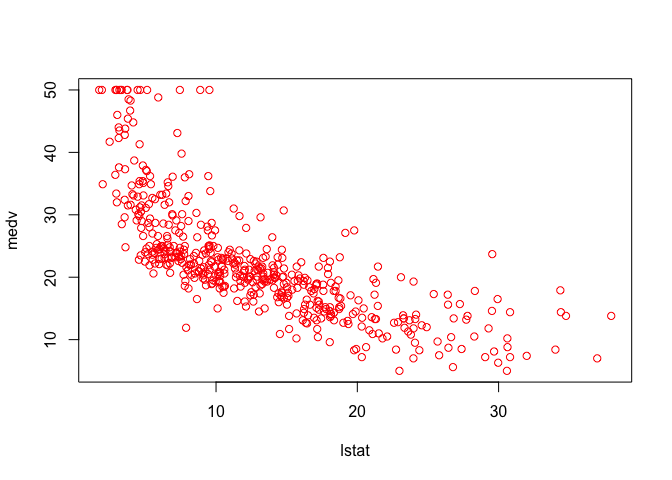

Ch3-linreg-lab
================

### Wenwen’s notes

  - confidence interval and prediction interval
    
      - The `predict()` function can be used to produce confidence
        intervals and prediction intervals for the prediction of `medv`
        (the response variable in the example) for a given value of
        `lstat` (the predictor variable in the
        example).
      - [Here](https://towardsdatascience.com/how-confidence-and-prediction-intervals-work-4592019576d8)
        is a nice summary of `confidence interval` and `prediction
        interval`. `The range that likely contains the value of the
        dependent variable for a single new observation given specific
        values of the independent variables, is the prediction
        interval.`

  - diagnostic plots for linear regression
    
      - [Understanding Diagnostic Plots for Linear Regression
        Analysis](https://data.library.virginia.edu/diagnostic-plots/)

  - standardized residuals vs studentized residuals
    
      - [This
        post](https://stats.stackexchange.com/questions/204708/is-studentized-residuals-v-s-standardized-residuals-in-lm-model)
        includes a nice summary

  - leverage statistic
    
      - We could use the `hatvalues()` function to calculate the
        leverage statistic, and use the `which.max()` function to
        identify the index of the largest element of a vector. In this
        case, it tells us which observation has the largest leverage
        statistic. `MY QUESTION: WHAT'S THE NEXT?`
    
      - See
        [here](https://www.r-bloggers.com/2016/06/leverage-and-influence-in-a-nutshell/)
        for a summary of the `leverage` and `influence` measures.

  - variance inflation
        factor
    
      - [wikipedia](https://en.wikipedia.org/wiki/Variance_inflation_factor)
      - [investopedia](https://www.investopedia.com/terms/v/variance-inflation-factor.asp)

-----

# Lab: Linear Regression

## Libraries

The `library()` function is used to load *libraries*, or groups of
functions and data sets that are not included in the base `R`
distribution. Basic functions that perform least squares linear
regression and other simple analyses come standard with the base
distribution, but more exotic functions require additional libraries.

Here we load the `MASS` package, which is a very large collection of
data sets and functions. We also load the `ISLR2` package, which
includes the data sets associated with this book.

``` r
library(MASS)
library(ISLR2)
```

    ## Warning: package 'ISLR2' was built under R version 4.0.5

    ## 
    ## Attaching package: 'ISLR2'

    ## The following object is masked from 'package:MASS':
    ## 
    ##     Boston

If you receive an error message when loading any of these libraries, it
likely indicates that the corresponding library has not yet been
installed on your system. Some libraries, such as `MASS`, come with `R`
and do not need to be separately installed on your computer. However,
other packages, such as `ISLR2`, must be downloaded the first time they
are used. This can be done directly from within `R`. For example, on a
Windows system, select the `Install package` option under the `Packages`
tab. After you select any mirror site, a list of available packages will
appear. Simply select the package you wish to install and `R` will
automatically download the package. Alternatively, this can be done at
the `R` command line via `install.packages("ISLR2")`. This installation
only needs to be done the first time you use a package. However, the
`library()` function must be called within each `R` session.

## Set the data directory

## Simple Linear Regression

The `ISLR2` library contains the `Boston` data set, which records `medv`
(median house value) for
 census tracts in Boston. We will seek to predict `medv` using
 predictors such as `rmvar` (average number of rooms per house),
`age` (average age of houses), and `lstat` (percent of households with
low socioeconomic status).

To find out more about the data set, we can type
    `?Boston`.

``` r
head(Boston)
```

    ##      crim zn indus chas   nox    rm  age    dis rad tax ptratio lstat medv
    ## 1 0.00632 18  2.31    0 0.538 6.575 65.2 4.0900   1 296    15.3  4.98 24.0
    ## 2 0.02731  0  7.07    0 0.469 6.421 78.9 4.9671   2 242    17.8  9.14 21.6
    ## 3 0.02729  0  7.07    0 0.469 7.185 61.1 4.9671   2 242    17.8  4.03 34.7
    ## 4 0.03237  0  2.18    0 0.458 6.998 45.8 6.0622   3 222    18.7  2.94 33.4
    ## 5 0.06905  0  2.18    0 0.458 7.147 54.2 6.0622   3 222    18.7  5.33 36.2
    ## 6 0.02985  0  2.18    0 0.458 6.430 58.7 6.0622   3 222    18.7  5.21 28.7

``` r
?Boston
```

    ## Help on topic 'Boston' was found in the following packages:
    ## 
    ##   Package               Library
    ##   ISLR2                 /Library/Frameworks/R.framework/Versions/4.0/Resources/library
    ##   MASS                  /Library/Frameworks/R.framework/Versions/4.0/Resources/library
    ## 
    ## 
    ## Using the first match ...

We will start by using the `lm()` function to fit a simple linear
regression model, with `medv` as the response and `lstat` as the
predictor. The basic syntax is {}, where `y` is the response, `x` is the
predictor, and `data` is the data set in which these two variables are
kept.

### We get the following error if we run the below command

> Error in eval(predvars, data, env) : object ‘medv’ not found

We comment out this chunk to avoid errors when kniting the markdown

\#`{r chunk3, error=TRUE} #lm.fit <- lm(medv ~ lstat) #`

The command causes an error because `R` does not know where to find the
variables `medv` and `lstat`. The next line tells `R` that the variables
are in `Boston`. If we attach `Boston`, the first line works fine
because `R` now recognizes the variables.

``` r
lm.fit <- lm(medv ~ lstat, data = Boston)
attach(Boston)
lm.fit <- lm(medv ~ lstat)
```

If we type `lm.fit`, some basic information about the model is output.
For more detailed information, we use `summary(lm.fit)`. This gives us
-values and standard errors for the coefficients, as well as the
 statistic and
-statistic for the model.

``` r
lm.fit
```

    ## 
    ## Call:
    ## lm(formula = medv ~ lstat)
    ## 
    ## Coefficients:
    ## (Intercept)        lstat  
    ##       34.55        -0.95

``` r
summary(lm.fit)
```

    ## 
    ## Call:
    ## lm(formula = medv ~ lstat)
    ## 
    ## Residuals:
    ##     Min      1Q  Median      3Q     Max 
    ## -15.168  -3.990  -1.318   2.034  24.500 
    ## 
    ## Coefficients:
    ##             Estimate Std. Error t value Pr(>|t|)    
    ## (Intercept) 34.55384    0.56263   61.41   <2e-16 ***
    ## lstat       -0.95005    0.03873  -24.53   <2e-16 ***
    ## ---
    ## Signif. codes:  0 '***' 0.001 '**' 0.01 '*' 0.05 '.' 0.1 ' ' 1
    ## 
    ## Residual standard error: 6.216 on 504 degrees of freedom
    ## Multiple R-squared:  0.5441, Adjusted R-squared:  0.5432 
    ## F-statistic: 601.6 on 1 and 504 DF,  p-value: < 2.2e-16

We can use the `names()` function in order to find out what other pieces
of information are stored in `lm.fit`. Although we can extract these
quantities by name—e.g. `lm.fit$coefficients`—it is safer to use the
extractor functions like `coef()` to access
    them.

``` r
names(lm.fit)
```

    ##  [1] "coefficients"  "residuals"     "effects"       "rank"         
    ##  [5] "fitted.values" "assign"        "qr"            "df.residual"  
    ##  [9] "xlevels"       "call"          "terms"         "model"

``` r
coef(lm.fit)
```

    ## (Intercept)       lstat 
    ##  34.5538409  -0.9500494

In order to obtain a confidence interval for the coefficient estimates,
we can use the `confint()` command. %Type `confint(lm.fit)` at the
command line to obtain the confidence intervals.

``` r
confint(lm.fit)
```

    ##                 2.5 %     97.5 %
    ## (Intercept) 33.448457 35.6592247
    ## lstat       -1.026148 -0.8739505

The `predict()` function can be used to produce confidence intervals and
prediction intervals for the prediction of `medv` for a given value of
`lstat`.

``` r
predict(lm.fit, data.frame(lstat = (c(5, 10, 15))),
    interval = "confidence")
```

    ##        fit      lwr      upr
    ## 1 29.80359 29.00741 30.59978
    ## 2 25.05335 24.47413 25.63256
    ## 3 20.30310 19.73159 20.87461

``` r
predict(lm.fit, data.frame(lstat = (c(5, 10, 15))),
    interval = "prediction")
```

    ##        fit       lwr      upr
    ## 1 29.80359 17.565675 42.04151
    ## 2 25.05335 12.827626 37.27907
    ## 3 20.30310  8.077742 32.52846

For instance, the 95,% confidence interval associated with a `lstat`
value of 10 is
"), and the 95,% prediction interval is
"). As expected, the confidence and prediction intervals
are centered around the same point (a predicted value of
 for `medv` when `lstat` equals 10), but the latter are
substantially wider.

We will now plot `medv` and `lstat` along with the least squares
regression line using the `plot()` and `abline()` functions.

``` r
plot(lstat, medv)
abline(lm.fit)
```

<!-- -->

There is some evidence for non-linearity in the relationship between
`lstat` and `medv`. We will explore this issue later in this lab.

The `abline()` function can be used to draw any line, not just the least
squares regression line. To draw a line with intercept `a` and slope
`b`, we type `abline(a, b)`. Below we experiment with some additional
settings for plotting lines and points. The `lwd = 3` command causes the
width of the regression line to be increased by a factor of 3; this
works for the `plot()` and `lines()` functions also. We can also use the
`pch` option to create different plotting symbols.

``` r
plot(lstat, medv)
abline(lm.fit, lwd = 3)
abline(lm.fit, lwd = 3, col = "red")
```

<!-- -->

``` r
plot(lstat, medv, col = "red")
```

<!-- -->

``` r
plot(lstat, medv, pch = 20)
```

<!-- -->

``` r
plot(lstat, medv, pch = "+")
```

<!-- -->

``` r
plot(1:20, 1:20, pch = 1:20)
```

<!-- -->

Next we examine some diagnostic plots, several of which were discussed
in `Section 3.3.3`. Four diagnostic plots are automatically produced by
applying the `plot()` function directly to the output from `lm()`. In
general, this command will produce one plot at a time, and hitting
*Enter* will generate the next plot. However, it is often convenient to
view all four plots together. We can achieve this by using the `par()`
and `mfrow()` functions, which tell `R` to split the display screen into
separate panels so that multiple plots can be viewed simultaneously. For
example, `par(mfrow = c(2, 2))` divides the plotting region into a  grid of panels.

``` r
par(mfrow = c(2, 2))
plot(lm.fit)
```

<!-- -->

Alternatively, we can compute the residuals from a linear regression fit
using the `residuals()` function. The function `rstudent()` will return
the studentized residuals, and we can use this function to plot the
residuals against the fitted values.

``` r
plot(predict(lm.fit), residuals(lm.fit))
```

<!-- -->

``` r
plot(predict(lm.fit), rstudent(lm.fit))
```

<!-- -->

On the basis of the residual plots, there is some evidence of
non-linearity. Leverage statistics can be computed for any number of
predictors using the `hatvalues()` function.

``` r
plot(hatvalues(lm.fit))
```

<!-- -->

``` r
which.max(hatvalues(lm.fit))
```

    ## 375 
    ## 375

The `which.max()` function identifies the index of the largest element
of a vector. In this case, it tells us which observation has the largest
leverage statistic.

## Multiple Linear Regression

In order to fit a multiple linear regression model using least squares,
we again use the `lm()` function. The syntax {} is used to fit a model
with three predictors, `x1`, `x2`, and `x3`. The `summary()` function
now outputs the regression coefficients for all the predictors.

``` r
lm.fit <- lm(medv ~ lstat + age, data = Boston)
summary(lm.fit)
```

    ## 
    ## Call:
    ## lm(formula = medv ~ lstat + age, data = Boston)
    ## 
    ## Residuals:
    ##     Min      1Q  Median      3Q     Max 
    ## -15.981  -3.978  -1.283   1.968  23.158 
    ## 
    ## Coefficients:
    ##             Estimate Std. Error t value Pr(>|t|)    
    ## (Intercept) 33.22276    0.73085  45.458  < 2e-16 ***
    ## lstat       -1.03207    0.04819 -21.416  < 2e-16 ***
    ## age          0.03454    0.01223   2.826  0.00491 ** 
    ## ---
    ## Signif. codes:  0 '***' 0.001 '**' 0.01 '*' 0.05 '.' 0.1 ' ' 1
    ## 
    ## Residual standard error: 6.173 on 503 degrees of freedom
    ## Multiple R-squared:  0.5513, Adjusted R-squared:  0.5495 
    ## F-statistic:   309 on 2 and 503 DF,  p-value: < 2.2e-16

The `Boston` data set contains 12 variables, and so it would be
cumbersome to have to type all of these in order to perform a regression
using all of the predictors. Instead, we can use the following
short-hand:

``` r
lm.fit <- lm(medv ~ ., data = Boston)
summary(lm.fit)
```

    ## 
    ## Call:
    ## lm(formula = medv ~ ., data = Boston)
    ## 
    ## Residuals:
    ##      Min       1Q   Median       3Q      Max 
    ## -15.1304  -2.7673  -0.5814   1.9414  26.2526 
    ## 
    ## Coefficients:
    ##               Estimate Std. Error t value Pr(>|t|)    
    ## (Intercept)  41.617270   4.936039   8.431 3.79e-16 ***
    ## crim         -0.121389   0.033000  -3.678 0.000261 ***
    ## zn            0.046963   0.013879   3.384 0.000772 ***
    ## indus         0.013468   0.062145   0.217 0.828520    
    ## chas          2.839993   0.870007   3.264 0.001173 ** 
    ## nox         -18.758022   3.851355  -4.870 1.50e-06 ***
    ## rm            3.658119   0.420246   8.705  < 2e-16 ***
    ## age           0.003611   0.013329   0.271 0.786595    
    ## dis          -1.490754   0.201623  -7.394 6.17e-13 ***
    ## rad           0.289405   0.066908   4.325 1.84e-05 ***
    ## tax          -0.012682   0.003801  -3.337 0.000912 ***
    ## ptratio      -0.937533   0.132206  -7.091 4.63e-12 ***
    ## lstat        -0.552019   0.050659 -10.897  < 2e-16 ***
    ## ---
    ## Signif. codes:  0 '***' 0.001 '**' 0.01 '*' 0.05 '.' 0.1 ' ' 1
    ## 
    ## Residual standard error: 4.798 on 493 degrees of freedom
    ## Multiple R-squared:  0.7343, Adjusted R-squared:  0.7278 
    ## F-statistic: 113.5 on 12 and 493 DF,  p-value: < 2.2e-16

``` r
?summary.lm
```

We can access the individual components of a summary object by name
(type `?summary.lm` to see what is available). Hence
`summary(lm.fit)$r.sq` gives us the
, and `summary(lm.fit)$sigma` gives us the RSE.

The `vif()` function, part of the `car` package, can be used to compute
variance inflation factors. Most VIF’s are low to moderate for this
data. The `car` package is not part of the base `R` installation so it
must be downloaded the first time you use it via the
`install.packages()` function in
    `R`.

``` r
installed.packages("car")
```

    ##      Package LibPath Version Priority Depends Imports LinkingTo Suggests
    ##      Enhances License License_is_FOSS License_restricts_use OS_type Archs
    ##      MD5sum NeedsCompilation Built

``` r
library(car)
```

    ## Loading required package: carData

    ## Warning: package 'carData' was built under R version 4.0.5

``` r
vif(lm.fit)
```

    ##     crim       zn    indus     chas      nox       rm      age      dis 
    ## 1.767486 2.298459 3.987181 1.071168 4.369093 1.912532 3.088232 3.954037 
    ##      rad      tax  ptratio    lstat 
    ## 7.445301 9.002158 1.797060 2.870777

What if we would like to perform a regression using all of the variables
but one? For example, in the above regression output, `age` has a high
-value. So we may wish to run a regression excluding this predictor.

The following syntax results in a regression using all predictors except
`age`.

``` r
lm.fit1 <- lm(medv ~ . - age, data = Boston)
summary(lm.fit1)
```

    ## 
    ## Call:
    ## lm(formula = medv ~ . - age, data = Boston)
    ## 
    ## Residuals:
    ##      Min       1Q   Median       3Q      Max 
    ## -15.1851  -2.7330  -0.6116   1.8555  26.3838 
    ## 
    ## Coefficients:
    ##               Estimate Std. Error t value Pr(>|t|)    
    ## (Intercept)  41.525128   4.919684   8.441 3.52e-16 ***
    ## crim         -0.121426   0.032969  -3.683 0.000256 ***
    ## zn            0.046512   0.013766   3.379 0.000785 ***
    ## indus         0.013451   0.062086   0.217 0.828577    
    ## chas          2.852773   0.867912   3.287 0.001085 ** 
    ## nox         -18.485070   3.713714  -4.978 8.91e-07 ***
    ## rm            3.681070   0.411230   8.951  < 2e-16 ***
    ## dis          -1.506777   0.192570  -7.825 3.12e-14 ***
    ## rad           0.287940   0.066627   4.322 1.87e-05 ***
    ## tax          -0.012653   0.003796  -3.333 0.000923 ***
    ## ptratio      -0.934649   0.131653  -7.099 4.39e-12 ***
    ## lstat        -0.547409   0.047669 -11.483  < 2e-16 ***
    ## ---
    ## Signif. codes:  0 '***' 0.001 '**' 0.01 '*' 0.05 '.' 0.1 ' ' 1
    ## 
    ## Residual standard error: 4.794 on 494 degrees of freedom
    ## Multiple R-squared:  0.7343, Adjusted R-squared:  0.7284 
    ## F-statistic: 124.1 on 11 and 494 DF,  p-value: < 2.2e-16

Alternatively, the `update()` function can be used.

``` r
lm.fit1 <- update(lm.fit, ~ . - age)
```

## Interaction Terms

It is easy to include interaction terms in a linear model using the
`lm()` function. The syntax `lstat:black` tells `R` to include an
interaction term between `lstat` and `black`. The syntax `lstat * age`
simultaneously includes `lstat`, `age`, and the interaction term
`lstat``age` as predictors; it is a shorthand for `lstat + age +
lstat:age`.

%We can also pass in transformed versions of the predictors.

``` r
summary(lm(medv ~ lstat * age, data = Boston))
```

    ## 
    ## Call:
    ## lm(formula = medv ~ lstat * age, data = Boston)
    ## 
    ## Residuals:
    ##     Min      1Q  Median      3Q     Max 
    ## -15.806  -4.045  -1.333   2.085  27.552 
    ## 
    ## Coefficients:
    ##               Estimate Std. Error t value Pr(>|t|)    
    ## (Intercept) 36.0885359  1.4698355  24.553  < 2e-16 ***
    ## lstat       -1.3921168  0.1674555  -8.313 8.78e-16 ***
    ## age         -0.0007209  0.0198792  -0.036   0.9711    
    ## lstat:age    0.0041560  0.0018518   2.244   0.0252 *  
    ## ---
    ## Signif. codes:  0 '***' 0.001 '**' 0.01 '*' 0.05 '.' 0.1 ' ' 1
    ## 
    ## Residual standard error: 6.149 on 502 degrees of freedom
    ## Multiple R-squared:  0.5557, Adjusted R-squared:  0.5531 
    ## F-statistic: 209.3 on 3 and 502 DF,  p-value: < 2.2e-16

## Non-linear Transformations of the Predictors

The `lm()` function can also accommodate non-linear transformations of
the predictors. For instance, given a predictor
, we can create a predictor
 using `I(X^2)`. The function `I()` is needed since the `^` has a
special meaning in a formula object; wrapping as we do allows the
standard usage in `R`, which is to raise `X` to the power `2`. We now
perform a regression of `medv` onto `lstat` and `lstat^2`.

``` r
lm.fit2 <- lm(medv ~ lstat + I(lstat^2))
summary(lm.fit2)
```

    ## 
    ## Call:
    ## lm(formula = medv ~ lstat + I(lstat^2))
    ## 
    ## Residuals:
    ##      Min       1Q   Median       3Q      Max 
    ## -15.2834  -3.8313  -0.5295   2.3095  25.4148 
    ## 
    ## Coefficients:
    ##              Estimate Std. Error t value Pr(>|t|)    
    ## (Intercept) 42.862007   0.872084   49.15   <2e-16 ***
    ## lstat       -2.332821   0.123803  -18.84   <2e-16 ***
    ## I(lstat^2)   0.043547   0.003745   11.63   <2e-16 ***
    ## ---
    ## Signif. codes:  0 '***' 0.001 '**' 0.01 '*' 0.05 '.' 0.1 ' ' 1
    ## 
    ## Residual standard error: 5.524 on 503 degrees of freedom
    ## Multiple R-squared:  0.6407, Adjusted R-squared:  0.6393 
    ## F-statistic: 448.5 on 2 and 503 DF,  p-value: < 2.2e-16

`The near-zero $p$-value associated with the quadratic term suggests
that it leads to an improved model.`

We use the `anova()` function to further quantify the extent to which
the quadratic fit is superior to the linear fit.

``` r
lm.fit <- lm(medv ~ lstat)
anova(lm.fit, lm.fit2)
```

    ## Analysis of Variance Table
    ## 
    ## Model 1: medv ~ lstat
    ## Model 2: medv ~ lstat + I(lstat^2)
    ##   Res.Df   RSS Df Sum of Sq     F    Pr(>F)    
    ## 1    504 19472                                 
    ## 2    503 15347  1    4125.1 135.2 < 2.2e-16 ***
    ## ---
    ## Signif. codes:  0 '***' 0.001 '**' 0.01 '*' 0.05 '.' 0.1 ' ' 1

Here Model 1 represents the linear submodel containing only one
predictor, `lstat`, while Model 2 corresponds to the larger quadratic
model that has two predictors, `lstat` and `lstat^2`.

The `anova()` function performs a hypothesis test comparing the two
models. The null hypothesis is that the two models fit the data equally
well, and the alternative hypothesis is that the full model is superior.
Here the
-statistic is
 and the associated
-value is virtually zero. This provides very clear evidence that the
model containing the predictors `lstat` and `lstat^2` is far superior to
the model that only contains the predictor `lstat`.

This is not surprising, since earlier we saw evidence for non-linearity
in the relationship between `medv` and `lstat`. If we type

``` r
par(mfrow = c(2, 2))
plot(lm.fit2)
```

<!-- -->

then we see that when the `lstat^2` term is included in the model, there
is little discernible pattern in the residuals.

In order to create a cubic fit, we can include a predictor of the form
`I(X^3)`. However, this approach can start to get cumbersome for
higher-order polynomials. A better approach involves using the `poly()`
function to create the polynomial within `lm()`. For example, the
following command produces a fifth-order polynomial fit:

``` r
lm.fit5 <- lm(medv ~ poly(lstat, 5))
summary(lm.fit5)
```

    ## 
    ## Call:
    ## lm(formula = medv ~ poly(lstat, 5))
    ## 
    ## Residuals:
    ##      Min       1Q   Median       3Q      Max 
    ## -13.5433  -3.1039  -0.7052   2.0844  27.1153 
    ## 
    ## Coefficients:
    ##                  Estimate Std. Error t value Pr(>|t|)    
    ## (Intercept)       22.5328     0.2318  97.197  < 2e-16 ***
    ## poly(lstat, 5)1 -152.4595     5.2148 -29.236  < 2e-16 ***
    ## poly(lstat, 5)2   64.2272     5.2148  12.316  < 2e-16 ***
    ## poly(lstat, 5)3  -27.0511     5.2148  -5.187 3.10e-07 ***
    ## poly(lstat, 5)4   25.4517     5.2148   4.881 1.42e-06 ***
    ## poly(lstat, 5)5  -19.2524     5.2148  -3.692 0.000247 ***
    ## ---
    ## Signif. codes:  0 '***' 0.001 '**' 0.01 '*' 0.05 '.' 0.1 ' ' 1
    ## 
    ## Residual standard error: 5.215 on 500 degrees of freedom
    ## Multiple R-squared:  0.6817, Adjusted R-squared:  0.6785 
    ## F-statistic: 214.2 on 5 and 500 DF,  p-value: < 2.2e-16

This suggests that including additional polynomial terms, up to fifth
order, leads to an improvement in the model fit\! However, further
investigation of the data reveals that no polynomial terms beyond fifth
order have significant
-values in a regression fit.

By default, the `poly()` function orthogonalizes the predictors: this
means that the features output by this function are not simply a
sequence of powers of the argument. However, a linear model applied to
the output of the `poly()` function will have the same fitted values as
a linear model applied to the raw polynomials (although the coefficient
estimates, standard errors, and p-values will differ). In order to
obtain the raw polynomials from the `poly()` function, the argument `raw
= TRUE` must be used.

Of course, we are in no way restricted to using polynomial
transformations of the predictors. Here we try a log transformation.

``` r
summary(lm(medv ~ log(rm), data = Boston))
```

    ## 
    ## Call:
    ## lm(formula = medv ~ log(rm), data = Boston)
    ## 
    ## Residuals:
    ##     Min      1Q  Median      3Q     Max 
    ## -19.487  -2.875  -0.104   2.837  39.816 
    ## 
    ## Coefficients:
    ##             Estimate Std. Error t value Pr(>|t|)    
    ## (Intercept)  -76.488      5.028  -15.21   <2e-16 ***
    ## log(rm)       54.055      2.739   19.73   <2e-16 ***
    ## ---
    ## Signif. codes:  0 '***' 0.001 '**' 0.01 '*' 0.05 '.' 0.1 ' ' 1
    ## 
    ## Residual standard error: 6.915 on 504 degrees of freedom
    ## Multiple R-squared:  0.4358, Adjusted R-squared:  0.4347 
    ## F-statistic: 389.3 on 1 and 504 DF,  p-value: < 2.2e-16

## Qualitative Predictors

We will now examine the `Carseats` data, which is part of the `ISLR2`
library. We will attempt to predict `Sales` (child car seat sales) in
 locations based on a number of
    predictors.

``` r
head(Carseats)
```

    ##   Sales CompPrice Income Advertising Population Price ShelveLoc Age Education
    ## 1  9.50       138     73          11        276   120       Bad  42        17
    ## 2 11.22       111     48          16        260    83      Good  65        10
    ## 3 10.06       113     35          10        269    80    Medium  59        12
    ## 4  7.40       117    100           4        466    97    Medium  55        14
    ## 5  4.15       141     64           3        340   128       Bad  38        13
    ## 6 10.81       124    113          13        501    72       Bad  78        16
    ##   Urban  US
    ## 1   Yes Yes
    ## 2   Yes Yes
    ## 3   Yes Yes
    ## 4   Yes Yes
    ## 5   Yes  No
    ## 6    No Yes

The `Carseats` data includes qualitative predictors such as `shelveloc`,
an indicator of the quality of the shelving location—that is, the space
within a store in which the car seat is displayed—at each location. The
predictor `shelveloc` takes on three possible values: *Bad*, *Medium*,
and *Good*. Given a qualitative variable such as `shelveloc`, `R`
generates dummy variables automatically. Below we fit a multiple
regression model that includes some interaction terms.

``` r
lm.fit <- lm(Sales ~ . + Income:Advertising + Price:Age, 
    data = Carseats)
summary(lm.fit)
```

    ## 
    ## Call:
    ## lm(formula = Sales ~ . + Income:Advertising + Price:Age, data = Carseats)
    ## 
    ## Residuals:
    ##     Min      1Q  Median      3Q     Max 
    ## -2.9208 -0.7503  0.0177  0.6754  3.3413 
    ## 
    ## Coefficients:
    ##                      Estimate Std. Error t value Pr(>|t|)    
    ## (Intercept)         6.5755654  1.0087470   6.519 2.22e-10 ***
    ## CompPrice           0.0929371  0.0041183  22.567  < 2e-16 ***
    ## Income              0.0108940  0.0026044   4.183 3.57e-05 ***
    ## Advertising         0.0702462  0.0226091   3.107 0.002030 ** 
    ## Population          0.0001592  0.0003679   0.433 0.665330    
    ## Price              -0.1008064  0.0074399 -13.549  < 2e-16 ***
    ## ShelveLocGood       4.8486762  0.1528378  31.724  < 2e-16 ***
    ## ShelveLocMedium     1.9532620  0.1257682  15.531  < 2e-16 ***
    ## Age                -0.0579466  0.0159506  -3.633 0.000318 ***
    ## Education          -0.0208525  0.0196131  -1.063 0.288361    
    ## UrbanYes            0.1401597  0.1124019   1.247 0.213171    
    ## USYes              -0.1575571  0.1489234  -1.058 0.290729    
    ## Income:Advertising  0.0007510  0.0002784   2.698 0.007290 ** 
    ## Price:Age           0.0001068  0.0001333   0.801 0.423812    
    ## ---
    ## Signif. codes:  0 '***' 0.001 '**' 0.01 '*' 0.05 '.' 0.1 ' ' 1
    ## 
    ## Residual standard error: 1.011 on 386 degrees of freedom
    ## Multiple R-squared:  0.8761, Adjusted R-squared:  0.8719 
    ## F-statistic:   210 on 13 and 386 DF,  p-value: < 2.2e-16

The `contrasts()` function returns the coding that `R` uses for the
dummy variables.

``` r
attach(Carseats)
contrasts(ShelveLoc)
```

    ##        Good Medium
    ## Bad       0      0
    ## Good      1      0
    ## Medium    0      1

Use `?contrasts` to learn about other contrasts, and how to set them.

`R` has created a `ShelveLocGood` dummy variable that takes on a value
of 1 if the shelving location is good, and 0 otherwise. It has also
created a `ShelveLocMedium` dummy variable that equals 1 if the shelving
location is medium, and 0 otherwise. A bad shelving location corresponds
to a zero for each of the two dummy variables. The fact that the
coefficient for `ShelveLocGood` in the regression output is positive
indicates that a good shelving location is associated with high sales
(relative to a bad location). And `ShelveLocMedium` has a smaller
positive coefficient, indicating that a medium shelving location is
associated with higher sales than a bad shelving location but lower
sales than a good shelving location.

## Writing Functions

As we have seen, `R` comes with many useful functions, and still more
functions are available by way of `R` libraries. However, we will often
be interested in performing an operation for which no function is
available. In this setting, we may want to write our own function. For
instance, below we provide a simple function that reads in the `ISLR2`
and `MASS` libraries, called `LoadLibraries()`. Before we have created
the function, `R` returns an error if we try to call it.

\#`{r chunk28, error=TRUE} #LoadLibraries #LoadLibraries() #`

We now create the function. Note that the `+` symbols are printed by `R`
and should not be typed in. The `{` symbol informs `R` that multiple
commands are about to be input. Hitting *Enter* after typing `{` will
cause `R` to print the `+` symbol. We can then input as many commands as
we wish, hitting {*Enter*} after each one. Finally the `}` symbol
informs `R` that no further commands will be entered.

``` r
LoadLibraries <- function() {
 library(ISLR2)
 library(MASS)
 print("The libraries have been loaded.")
}
```

Now if we type in `LoadLibraries`, `R` will tell us what is in the
function.

``` r
LoadLibraries
```

    ## function() {
    ##  library(ISLR2)
    ##  library(MASS)
    ##  print("The libraries have been loaded.")
    ## }

If we call the function, the libraries are loaded in and the print
statement is output.

``` r
LoadLibraries()
```

    ## [1] "The libraries have been loaded."
